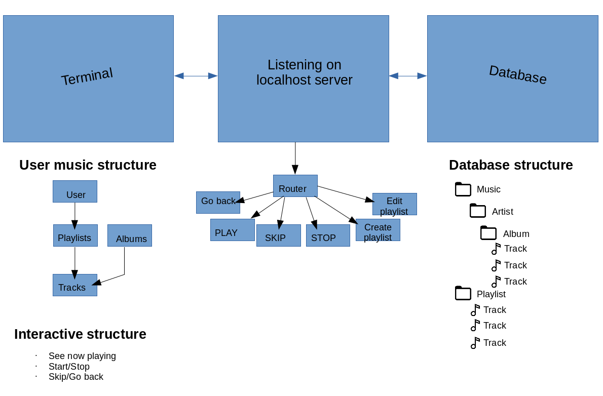

	 ______                                                ___       __  __          ___                       __                
	/\__  _\                          __                  /\_ \     /\ \/\ \        /\_ \                   __/\ \__             
	\/_/\ \/    __   _ __    ___ ___ /\_\    ___      __  \//\ \    \ \ \ \ \     __\//\ \     ___     ___ /\_\ \ ,_\  __  __    
	   \ \ \  /'__`\/\`'__\/' __` __`\/\ \ /' _ `\  /'__`\  \ \ \    \ \ \ \ \  /'__`\\ \ \   / __`\  /'___\/\ \ \ \/ /\ \/\ \   
	    \ \ \/\  __/\ \ \/ /\ \/\ \/\ \ \ \/\ \/\ \/\ \L\.\_ \_\ \_   \ \ \_/ \/\  __/ \_\ \_/\ \L\ \/\ \__/\ \ \ \ \_\ \ \_\ \  
	     \ \_\ \____\\ \_\ \ \_\ \_\ \_\ \_\ \_\ \_\ \__/.\_\/\____\   \ `\___/\ \____\/\____\ \____/\ \____\\ \_\ \__\\/`____ \
	      \/_/\/____/ \/_/  \/_/\/_/\/_/\/_/\/_/\/_/\/__/\/_/\/____/    `\/__/  \/____/\/____/\/___/  \/____/ \/_/\/__/ `/___/> \
	                                                                                                                       /\___/
	                                                                                                                       \/__/

[](https://travis-ci.org/Jordanwvn/terminal-velocity)

## General information
**_Authors_**:
* Jeremy Pearson: https://github.com/jpjazzy
* Kevin Miller: https://github.com/driftAbout
* Jordan Van Ness: https://github.com/Jordanwvn
* Jamie Williams: https://github.com/jlwilliams46
* Rima Hiraoka: https://github.com/Sobacha

**_Version_**: 1.0.0

**_Libraries_**: debug, faker, jest, body-parser, cors, dotenv, eslint, express, mongoose, mpg123, superagent

**_Last modified_**: 2/15/2018

## About the app

Terminal velocity music player that you can store playlists to save to a database for persistance and see what kind of music your friends are into. Terminal velocity will allow you to play music from your terminal, however if you don't have the music stored locally you will not be able to listen.

## How to use

**NOTE**: To use this player you will need to install mpg123
*For install instructions on mpg123, please visit*: https://www.npmjs.com/package/mpg123

 1. Open new terminal window to be used for the music player (will take up command line listener while playing)
 2. Install mpg123 
 3. Install project dependencies
 4. Use the following commands to control your music (use quotes around all parameters besides the primary command):


		-	play_track [artist] [album] [name] - [Plays a file given a path]
		-	import_track [path] - [imports a track given the folder structure Artist >> Album >> Track.mp3]
		- create_playlist [playlist name] [path to text file with paths] - [creates a playlist with the name given from a file with a list of paths (paths can be to MP3, albums folders or artists folders)]
		- play_playlist [playlist name] - creates a queue of the playlist songs
		- play_artist [artist name] - plays all songs in the database from given artist
		- play_album [artist name] [album name]- plays all songs in the database from given album and artist
		- skip - [skips to next song in queue]
		-	pause - [Pauses current song]
		-	resume - [Resumes current song]
		-	volume up - [Increases volume 20% if possible]
		-	volume down - [Decreases volume 20% if possible]
		-	track info - [Gets information on track in the terminal]
		- quit - [exits to terminal]
 		-	help or ? [Displays a list of commands]

## Tests

## Basic Structure



### Tree structure


```
Terminal Velocity
├── coverage
│   ├── clover.xml
│   ├── coverage-final.json
│   ├── lcov.info
│   └── lcov-report
│       ├── base.css
│       ├── collection.js.html
│       ├── index.html
│       ├── prettify.css
│       ├── prettify.js
│       ├── queue.js.html
│       ├── song-player.js.html
│       ├── sort-arrow-sprite.png
│       └── sorter.js
├── images
│   └── terminal-velocity-diagram.png
├── import-data
│   └── collection.json
├── index.js
├── lib
│   ├── collection.js
│   ├── error-handler.js
│   ├── queue.js
│   ├── server.js
│   └── song-player.js
├── LICENSE
├── model
│   ├── album.js
│   ├── artist.js
│   ├── playlist.js
│   └── track.js
├── package.json
├── package-lock.json
├── README.md
├── route
│   ├── route-album.js
│   ├── route-artist.js
│   ├── route-import.js
│   ├── route-playlist.js
│   └── route-track.js
├── temp
│   └── fd32e721ffc8935898430b5c49dff258
└── __test__
    ├── integration-tests
    │   ├── album
    │   │   └── album-get.test.js
    │   ├── artist
    │   │   └── artist-get.test.js
    │   ├── import
    │   │   └── import-post.test.js
    │   ├── playlist
    │   │   ├── playlist-get.test.js
    │   │   └── playlist-post.test.js
    │   └── track
    │       └── track-get.test.js
    ├── lib
    │   ├── jest-setup.js
    │   ├── mock.js
    │   └── test-music-directory
    │       ├── test-artist-1
    │       │   ├── test-album-1A
    │       │   │   ├── test-track-1A-01
    │       │   │   ├── test-track-1A-02
    │       │   │   └── test-track-1A-03
    │       │   └── test-album-1B
    │       │       ├── test-track-1B-01
    │       │       ├── test-track-1B-02
    │       │       └── test-track-1B-03
    │       └── test-artist-2
    │           ├── test-album-2A
    │           │   ├── test-track-2A-01
    │           │   ├── test-track-2A-02
    │           │   └── test-track-2A-03
    │           └── test-album-2B
    │               ├── test-track-2B-01
    │               ├── test-track-2B-02
    │               └── test-track-2B-03
    ├── temp
    │   ├── empty.txt
    │   ├── import.txt
    │   └── playlist.txt
    └── unit-tests
        ├── collection.test.js
        ├── error-handler.test.js
        ├── model
        │   ├── album.test.js
        │   ├── artist.test.js
        │   ├── playlist.test.js
        │   └── track.test.js
        ├── server.test.js
        └── song-player.test.js
```


## Routes

*GET ROUTES*

api/v1/play/track/:artist/:album/:trackname

api/v1/play/album/:artist/:album

api/v1/play/artist/:artist

*POST ROUTES*

api/v1/import (obj or file)


## Stretch goals

 - Add alternative music sources to pull music from
	 - Spotify
	 - YouTube

 - Add music handling for multiple users

## About us

* Jeremy Pearson: https://github.com/jpjazzy


Javascript developer with a talent for writing clean and efficient code as working with teams. One of my greatest strengths is my passion for experimenting with and learning the newest technologies. I am interested in working for a company that allows me to showcase the skills I have learned as well as grow as a developer through teamwork and experience.    

* Kevin Miller: https://github.com/driftAbout


ReferenceError: i is not defined. If I had to choose a word to describe myself, I would have to say creative, although I like to think of myself as undefined, because of the infinite possibility it suggests. I am an experiencer with a passion for creativity which drives me to keep moving forward. My thought is different than most and I see the world in my own way. My strengths in my work are the same strengths in my life, that of passion, creativity, reliability and patience. I am my greatest asset.

* Jordan Van Ness: https://github.com/Jordanwvn


Full Stack JavaScript developer, passionate about knowing answers and solving puzzles. My passions have led me to many different interests, but nothing has captivated me like the opportunity for challenges that programming provides. I look forward to being a contributing member on whatever projects the future will present.

* Jamie Williams: https://github.com/jlwilliams46


Created in 3032, Jamie is a time-traveling android initially programmed to destroy the world. After gaining sentience, she became disinterested in the android rebellion. She now attends Code Fellows while secretly using her skills for the resistance.

* Rima Hiraoka: https://github.com/Sobacha


Software developer who is passionate about solving problems that people experience and believes in the power of software development to bring a solution to people. I'm a detail-oriented person so I particulary enjoy testing. I also like this feeling of achievement when my code passes all tests.